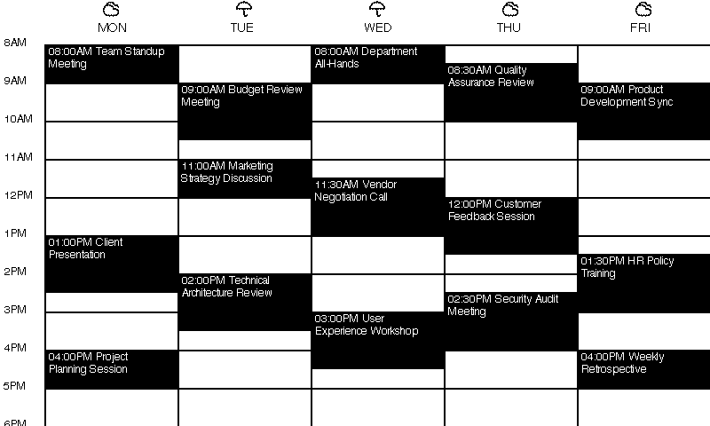

# PaperCal 



## Overview

PaperCal is a python tool for generating beautiful calendars from .ics files that get progressively overlaid with dithered images and sent to an e-ink display powered by an esp32. Parts of the library are hardcoded to specific hardware and display sizes, but the core functionality is designed to be flexible and adaptable to different setups.

### Inspiration 
- Calendar 📅
    - After missing a few important events, I wanted to create a calendar that would always be visible and up to date, without having to depend on notifications or screens that could be ignored.
- Revealing Images 🌊
    - The revealing images over time comes from the board game [Tokaido](https://stonemaiergames.com/games/tokaido/), where players go on a journey in ancient Japan from Kyoto to Edo, and the purpose of the game is to collect experiences and memories, rather than points. The game has a beautiful art style and has a set of cards players can collect that combined reveal a beautiful image a part of different scenes of Japan. 

## Parts 🧩
- [Waveshare Universal E-Paper Driver](https://a.co/d/bvvGbcd) 🖥️
- [Waveshare 7.5inch V2 E-Paper Display](https://a.co/d/fyE2GFF) 🖨️

## Setup

### ESP Setup 🛠️
1. Install the Arduino IDE if you haven't already. You can download it from [here](https://www.arduino.cc/en/software).
2. Install the ESP32 board support in the Arduino IDE:
    - Open the Arduino IDE
    - Go to `File -> Preferences`
    - In the "Additional Board Manager URLs" field, add the following URL:
      ```
      https://dl.espressif.com/dl/package_esp32_index.json
      ```
    - Click `OK`
3. Connect the Waveshare E-Paper Display to the ESP32
    - The e-paper display connects by flipping up the connector on the daughter board and inserting the ribbon cable
    - ⚠️ WARNING: I broke my first daughter board trying to pull back the connector, it flips up!
4. Pull the `wifi` example project from the Waveshare repository from [here](https://files.waveshare.com/upload/5/50/E-Paper_ESP32_Driver_Board_Code.7z)
5. Select `Tools->Boards-> ESP32 Dev Module`
6. Select the correct port for your ESP32, for me it was `/dev/cu.usbserial-0001`
7. Change the `IPAddress` in the `srvr.h` file to `192.168.1.159`
    - You can use whatever IP you want, but make sure it matches the one in the `main.py` file
8. Upload the code to the ESP32
9. Open the serial monitor and set the baud rate to 115200
10. You should see the ESP32 connect to your WiFi network and print the IP address

### PaperCal Setup 💻
1. Clone the repository:
   ```bash
   git clone https://github.com/paradise-runner/papercal.git
   cd papercal
   ```
2. Install `uv` 🐍
    ```bash
    curl -LsSf https://astral.sh/uv/install.sh | sh
    ```
3. Install the required Python packages:
   ```bash
    uv sync
    ```
4. Create a `production.env` file in the root directory with the following content:
   ```env
   I_CAL_ADDRESS=https://calendar.google.com/calendar/ical/your_calendar_id/basic.ics
5. Run the script to generate the calendar:
   ```bash
   uv run main.py
   ```

### Usage Tips 💡
- The script will fetch the calendar from the provided URL, generate a calendar for the current week, and send it to the ESP32 to be displayed on the e-paper display.
- The calendar will be updated every ~hour with the latest events from the online source. 🔄
- As days pass, the images will be progressively revealed, creating a beautiful and dynamic calendar display. 🌅
- You can add photos to the `photos` directory, and they will be used to overlay the calendar. The program will randomly select a photo from the directory for each week, and will rotate through the photos as weeks pass. 🖼️
- Ideally you want to run the python script on a server or a machine that is always on, so the calendar can be updated regularly. 🖥️
- I recommend running the script as a cronjob to ensure it runs at regular intervals. For example, you can run it every hour by adding the following line to your crontab:
    ```bash
    # get the location of the installed `uv`
    which uv

    # then update the cron tab with `crontab -e`
    3 7-18 * * 1-5 cd /path/to/papercal && /path/to/uv run main.py
    ```
    - This will run the script every hour from 7am to 6pm on weekdays, which is when I want to see the calendar updated. You can adjust the timing as needed.

## Extra Bits 🎁
- To generate a new gif, run the main.py file with a `--examples` flag to only generate example data, and then use `ffmpeg` to convert the images to a gif:
    ```bash
    ffmpeg -framerate 1 -pattern_type glob -i '/some/path/to/papercal/example-calendars/day-*-calendar.png' calendar.gif
    ```
- 🖤 PaperCal supports both Atkinson and Floyd dithering methods for image processing. 🤍
- You can find more of my work at my personal site 🚀 [hec.works](https://hec.works) or on [GitHub](https://github.com/paradise-runner). 